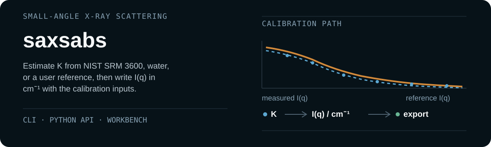

# AbsSAXS｜同步辐射小角散射绝对强度标定工具

<p align="center">
  <a href="https://github.com/D-sudoasd/AbsSAXS/actions/workflows/ci.yml"></a>
  <a href="https://doi.org/10.5281/zenodo.19687103"></a>
  <a href="LICENSE"></a>
  
</p>

**AbsSAXS** (`saxsabs` Python package and command) converts small-angle X-ray
scattering (SAXS) measurements to an absolute intensity scale. It estimates
the calibration factor `K` from NIST SRM 3600 glassy carbon, water at a
documented temperature, or a user-supplied reference. Monitor and transmission
normalisation, sample thickness, and
intensity state are recorded with the result. Outputs are CSV/TSV, canSAS1d
XML, and optional NXcanSAS HDF5.

The intended users are beamline scientists and SAXS experimenters who need to
place external 1D profiles, or detector images with compatible metadata and
geometry, onto a cm⁻¹ scale and keep the processing record with the result.
pyFAI handles detector geometry and azimuthal integration. FabIO reads
detector images. Dioptas explores two-dimensional diffraction. SasView and
Irena fit small-angle models. BioXTAS RAW reduces BioSAXS data and can scale
to water or glassy carbon. `saxsabs` focuses on absolute-scale calibration for
external 1D data and the current BL19B2 2D workflow. It names the intensity
state (`raw_counts`, `relative`, `absolute_cm^-1`, or `ambiguous`) and runs
scaling or buffer subtraction only when that state and the required physical
inputs are compatible.

<p align="center">
  
</p>

<p align="center">
  <a href="#installation"><strong>Installation</strong></a> ·
  <a href="#example-usage">Example usage</a> ·
  <a href="#workflows">Workflows</a> ·
  <a href="docs/api.md">API reference</a> ·
  <a href="docs/architecture.md">Architecture</a> ·
  <a href="#citation">Citation</a>
</p>

## Installation

Python 3.10 or later is required. The core package depends on NumPy, pandas,
and xraydb. Install from the source tree on `main` (version `2.0.0`,
unreleased):

```bash
git clone https://github.com/D-sudoasd/AbsSAXS.git
cd AbsSAXS
python -m pip install -e .
```

No PyPI package is documented. GitHub Release
[`v1.1.1`](https://github.com/D-sudoasd/AbsSAXS/releases/tag/v1.1.1) is the
last archived tag. The DOI badge above is the project concept DOI, not a
version DOI for `2.0.0`.

On Windows, `py -m pip install -e .` is the equivalent Python-launcher form.

<details>
<summary><strong>Optional dependency groups</strong></summary>

```bash
python -m pip install -e ".[gui]"      # SAXSAbs Workbench
python -m pip install -e ".[hdf5]"     # NXcanSAS HDF5
python -m pip install -e ".[io]"       # FabIO detector-image I/O
python -m pip install -e ".[bl19b2]"   # strict BL19B2 workflow
python -m pip install -e ".[dev]"      # tests and Ruff
```

The Workbench uses Tk. Windows and macOS Python installers commonly include
it. On Linux, install the distribution Tk package (often `python3-tk`) if
`python -m tkinter` cannot open a test window. API and CLI workflows do not
need a display server.

</details>

## Example usage

```bash
saxsabs norm-factor --mode rate --exp 1.0 --mon 100000 --trans 0.8
# 80000.0

saxsabs estimate-k --meas examples/k_measured.csv --intensity-state relative
```

`estimate-k` uses the built-in NIST SRM 3600 curve when `--ref` is omitted.
The measured file must be on a relative intensity scale; the command stops if
that state is missing or inconsistent.

```python
from saxsabs import compute_norm_factor

factor = compute_norm_factor(1.0, 100000.0, 0.8, "rate")
# 80000.0
```

The [API reference](docs/api.md) lists the public calculation and I/O
functions, including `estimate_k_factor_robust`, intensity-state gates, and
the canSAS / NXcanSAS writers.

## Workflows

<p align="center">
  
</p>

| Route | Use when | Start here |
| --- | --- | --- |
| **CLI utilities** | normalisation, header and 1D parsing, gated `K` estimation, gated buffer and fluorescence subtraction | `saxsabs --help` |
| **SAXSAbs Workbench** | interactive `K` calibration, batch processing, external-1D scaling | `saxsabs-workbench --lang en` |
| **Strict BL19B2 runner** | campaign inputs under current BL19B2 conventions | [batch runbook](docs/bl19b2_abs2d_batch_runbook.md) |
| **Python API** | reusable scientific calculations and file I/O | [API reference](docs/api.md) |

The routes share numerical and I/O modules. The Workbench is an interactive
front end. The BL19B2 runner is a separate, stricter campaign path.

<p align="center">
  
</p>

## Workbench

<p align="center">
  
</p>

Install `.[gui]` and run `saxsabs-workbench --lang en`. The window covers `K`
calibration, 2D batch processing, external-1D scaling, and built-in help. On
Windows, `py saxsabs_workbench.py --lang en` launches the same application.

## Reproducible example

The bundled example plants deterministic synthetic dark, background, standard,
and sample frames on a 9×9 array, subtracts a NIST blank in detector space,
and reduces with a homemade integer-bin radial average:

```bash
python examples/minimal_2d/run_minimal_2d_pipeline.py
```

It writes CSV, TSV, and XML, plus HDF5 when `h5py` is installed. The script
gates the standard profile as `relative` before `K`, writes `absolute_cm^-1`
metadata, and checks that the XML exposes `i_abs` rather than `i_rel`.
Acceptance in `summary.json` requires `k_relative_error < 0.005` and
`sample_max_relative_error < 0.01`. Construction details are in the
[example documentation](examples/minimal_2d/README.md).

<p align="center">
  
</p>

## Records and outputs

- reference-derived `K` using NIST SRM 3600, water, or a supplied profile
  (median ratio after MAD filtering)
- explicit `raw_counts`, `relative`, `absolute_cm^-1`, and `ambiguous` states
- transmission, thickness, monitor semantics, units, and applied corrections
- partial uncertainty status, without substituting zero for unknown terms
- source identity where available, calibration context, and processing metadata
- CSV/TSV, canSAS1d XML, and optional NXcanSAS HDF5

## Scope and limitations

Absolute calibration still depends on a suitable reference, detector geometry,
monitor semantics, transmission, thickness, and instrument-specific
provenance. The strict 2D workflow currently follows BL19B2 conventions. The
Workbench does not implement that campaign contract.

The 9×9 example recovers a planted synthetic `K` and sample curve. It is
not pyFAI integration, BL19B2 campaign validation, measured-beamline
validation, or independent third-party format validation.

canSAS1d and NXcanSAS layouts are covered by project-local round-trip tests.
An offline check on 15 August 2026 validated the deterministic example
against the official canSAS1d 1.1 XSD and punx 0.3.5 with its bundled v2018.5
definitions; that check is not in CI. Current NeXus definitions and
third-party consumers have not been verified.

## Documentation

- [API reference](docs/api.md): public functions, inputs, outputs, and boundaries
- [Architecture](docs/architecture.md): module responsibilities and interface limits
- [BL19B2 runbook](docs/bl19b2_abs2d_batch_runbook.md): strict 2D campaign path
- [Manual verification](examples/manual-verification.md): GUI and workflow checks
- [Reviewer FAQ](docs/reviewer-faq.md): evidence, scope, and known limitations
- [Changelog](CHANGELOG.md): version history

JOSS submission gates and author-confirmation records live in
[SUBMISSION_READINESS.md](SUBMISSION_READINESS.md) and `docs/`. They are not
required to install or run the software.

## Development

The [continuous-integration workflow](https://github.com/D-sudoasd/AbsSAXS/actions/workflows/ci.yml)
tests the configured Python and operating-system matrix.

```bash
python -m pip install -e ".[dev,gui,bl19b2,hdf5]"
pytest -q
ruff check SASAbs.py saxs_mpl_style.py src tests paper/*.py scripts/*.py
```

Report reproducible problems on the
[issue tracker](https://github.com/D-sudoasd/AbsSAXS/issues). Questions that
are neither a defect nor a feature proposal can go to the same tracker or to
the maintainers listed in [CITATION.cff](CITATION.cff). Read
[CONTRIBUTING.md](CONTRIBUTING.md) before opening a pull request. Project
participation follows the [Code of Conduct](CODE_OF_CONDUCT.md).

## Citation

For the project as a whole, use the Zenodo concept DOI:

> Gong, D. *SASAbs*. https://doi.org/10.5281/zenodo.19687103

Use a release-specific DOI only for the archived release it identifies.
Machine-readable metadata are in [CITATION.cff](CITATION.cff).

## License

AbsSAXS is distributed under the [BSD-3-Clause license](LICENSE).
