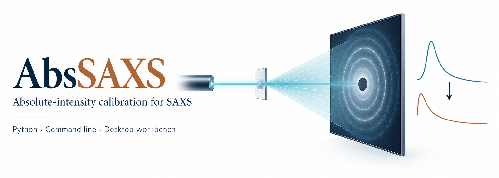
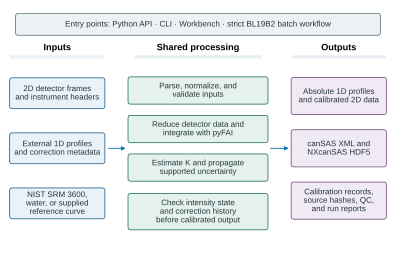
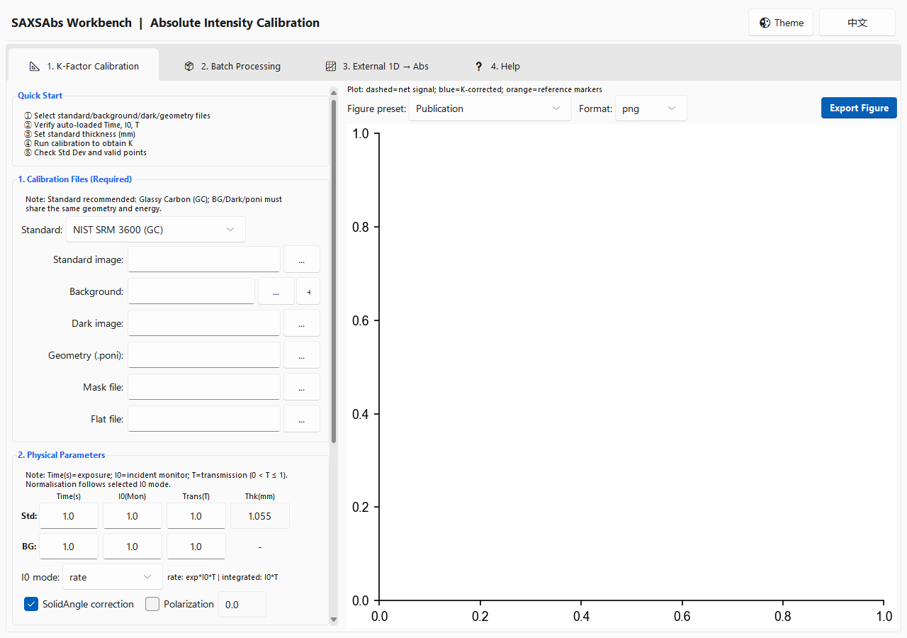
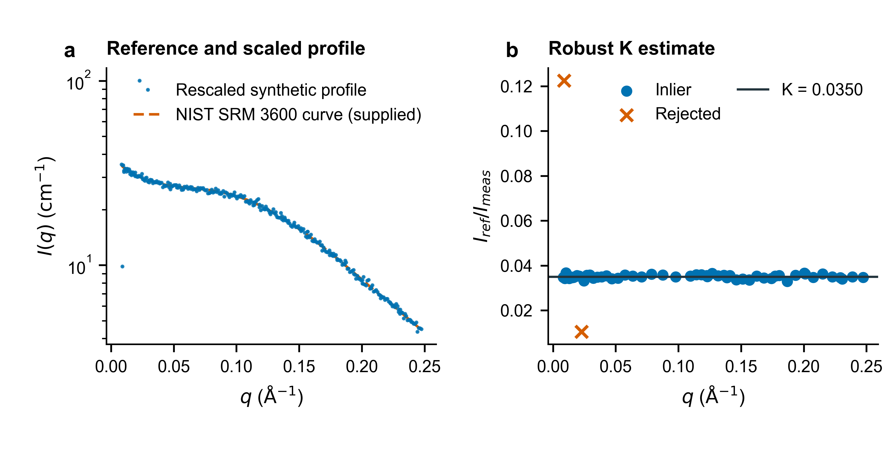

# AbsSAXS

<p align="center">
  <a href="https://github.com/D-sudoasd/AbsSAXS/actions/workflows/ci.yml"></a>
  <a href="https://doi.org/10.5281/zenodo.19687103"></a>
  <a href="LICENSE"></a>
  
</p>

<p align="center">
  
</p>

<p align="center">
  <a href="#installation"><strong>Installation / 安装</strong></a> ·
  <a href="#example-usage">Examples / 示例</a> ·
  <a href="#workflows">Workflows / 工作流</a> ·
  <a href="#workbench">Workbench / 工作台</a> ·
  <a href="docs/api.md">API</a> ·
  <a href="#中文快速开始">中文快速开始</a> ·
  <a href="#citation">Citation / 引用</a>
</p>

**Absolute-intensity calibration for small-angle X-ray scattering (SAXS).**

**小角 X 射线散射（SAXS）绝对强度标定。**

根据参考标准与测量条件估计标定因子 `K`，记录监测计数、透射率、厚度、
强度状态及校正历史。提供 Python API、命令行与 SAXSAbs Workbench；
中文用户可直接进入[快速开始](#中文快速开始)。

A SAXS profile may begin as detector counts or relative intensity. To compare it
with a reference, its scale must be established from the measurement conditions
and calibration standard. AbsSAXS estimates the scale factor `K` and records
the monitor, transmission, thickness, intensity state, and corrections
associated with the result.

The `saxsabs` Python package provides a command-line interface, a Python API,
and the SAXSAbs Workbench desktop application. It supports external 1D profiles
and a strict 2D workflow for SPring-8 BL19B2 conventions. The project is intended
for beamline scientists and SAXS researchers who need to calibrate and exchange
absolute-intensity profiles with their processing context.

## What it does

- Normalizes accumulated detector counts using either a beam-monitor count
  rate (`rate`, in counts/s) integrated over exposure time, or integrated
  monitor counts (`integrated`); sample transmission is included in either
  mode.
- Estimates `K` from NIST SRM 3600 glassy carbon, water at a documented
  temperature, or a supplied reference curve.
- Tracks whether a profile contains `raw_counts`, `relative`, `absolute_cm^-1`,
  or `ambiguous` intensity, and gates operations when the state or required
  inputs are incompatible.
- Supports buffer subtraction and optional 1D fluorescence subtraction for
  profiles with compatible units, correction history, and provenance.
- Reads supported text, canSAS1d XML, and NXcanSAS HDF5 profiles; writes CSV,
  TSV, canSAS1d XML, and optional NXcanSAS HDF5.
- Provides strict BL19B2 detector-image workflows alongside the interactive
  Workbench.

Related tools address different stages of SAXS work. pyFAI provides detector
geometry and azimuthal integration; SasView and Irena support data analysis and
model fitting; BioXTAS RAW supports BioSAXS reduction and absolute scaling
against water or glassy carbon. AbsSAXS focuses on calibration for external 1D
profiles and the documented BL19B2 2D workflow, with processing context carried
alongside results.

## Installation

Python 3.10 or later is required. The core package depends on NumPy, pandas, and
xraydb. Install the current source checkout with:

```bash
git clone https://github.com/D-sudoasd/AbsSAXS.git
cd AbsSAXS
python -m pip install -e .
saxsabs --version
```

The current source reports version `2.0.0`, an unreleased candidate for JOSS
review. The latest archived release is
[`v1.1.1`](https://github.com/D-sudoasd/AbsSAXS/releases/tag/v1.1.1).

Install optional features only when needed:

| Extra | Adds |
| --- | --- |
| `gui` | SAXSAbs Workbench, detector-image support, and plotting dependencies |
| `io` | FabIO detector-image I/O |
| `hdf5` | NXcanSAS HDF5 writing |
| `bl19b2` | Dependencies for the strict BL19B2 workflows |
| `dev` | Pytest, Ruff, and development tools |

For example:

```bash
python -m pip install -e ".[gui]"
python -m pip install -e ".[hdf5]"
```

The Workbench uses Tk, which is included with many Windows and macOS Python
distributions. On Linux, install the system Tk package (often `python3-tk`) if
`python -m tkinter` is unavailable. The CLI and Python API do not require a
display server.

## Example usage

For `rate` mode, `MON` is a monitor count rate in counts/s and `exp` is exposure
time in seconds. For `integrated` mode, `MON` is the monitor count accumulated
over the exposure. Detector data are accumulated counts in both modes.

```bash
# Rate mode: MON=100,000 counts/s; exposure=1 s; transmission=0.8
saxsabs norm-factor --mode rate --exp 1.0 --mon 100000 --trans 0.8
# 80000.0

# Integrated mode: MON=100,000 monitor counts; transmission=0.8
saxsabs norm-factor --mode integrated --mon 100000 --trans 0.8
# 80000.0
```

Estimate `K` from the bundled example profiles:

```bash
saxsabs estimate-k --meas examples/k_measured.csv --ref examples/k_reference.csv --qmin 0.01 --qmax 0.2
```

The measured input must already be reduced to relative intensity with
appropriate dark/background subtraction and monitor/transmission
normalization; thickness must be accounted for either in the profile or through
`--thickness-cm`. The CLI requires an explicit `relative` state and refuses
raw-count, ambiguous, and already absolute input. The example file declares
`intensity_state=relative`, and its paired reference declares
`absolute_cm^-1`. It reports `k_factor: 2.0`. These demonstration profiles are
not beamline measurements.

The same normalization is available through the Python API:

```python
from saxsabs import compute_norm_factor

# MON = 100,000 counts/s; exposure = 1 s; transmission = 0.8
factor = compute_norm_factor(1.0, 100000.0, 0.8, "rate")
print(factor)  # 80000.0
```

See the [API and command-line reference](docs/api.md) for function signatures,
supported formats, required metadata, and scientific boundaries.

## Workflows

| Route | Use it for | Start here |
| --- | --- | --- |
| **Command line** | Normalization, header and profile parsing, 1D calibration, subtraction, and scripted workflows | `saxsabs --help` |
| **Python API** | Reusing calculations, parsers, and output writers | [API reference](docs/api.md) |
| **SAXSAbs Workbench** | Interactive calibration, external 1D scaling, and desktop workflows | Install `.[gui]`, then run `saxsabs-workbench --lang en` |
| **Strict BL19B2 runner** | Detector-image workflows under BL19B2 conventions | [Batch runbook](docs/bl19b2_abs2d_batch_runbook.md) |

The Workbench is an interactive front end. For unattended campaigns, use the
strict command-line workflow and its documented input contract.

<p align="center">
  
</p>

## Workbench

Install the GUI extra and launch the English interface with:

```bash
python -m pip install -e ".[gui]"
saxsabs-workbench --lang en
```

The Workbench provides interactive calibration, external 1D scaling, and
batch-processing tools. Its current interface is shown below; the strict BL19B2
runbook describes the separate campaign workflow.

<p align="center">
  
</p>

## Reproducible 2D example

Run the deterministic synthetic workflow:

```bash
python examples/minimal_2d/run_minimal_2d_pipeline.py
```

It creates separate synthetic dark, blank, standard, and sample detector frames
on a 9×9 array, then checks the 2D-to-1D-to-absolute-intensity path. The example
uses a small, homemade integer-bin radial average. This is not pyFAI
integration, a BL19B2 campaign test, or measured-beamline validation. It
recovers the planted `K` and sample curve within the acceptance limits recorded
in `summary.json`, and writes CSV, TSV, and canSAS1d XML. NXcanSAS HDF5 is added
when `h5py` is installed. See the
[example README](examples/minimal_2d/README.md) for its inputs and expected files.

<p align="center">
  
</p>

## Scope and validation

Absolute calibration depends on a suitable reference, detector geometry, monitor
semantics, transmission, thickness, and instrument-specific metadata. AbsSAXS
records supplied calibration context and checks whether required inputs are
present and compatible. Automated tests and the
[manual verification checklist](examples/manual-verification.md) provide
reproducible software checks without private beamline files; they do not
establish that experiment-specific inputs are valid.

## Documentation and support

- [API and command-line reference](docs/api.md)
- [Architecture and supported boundaries](docs/architecture.md)
- [BL19B2 batch runbook](docs/bl19b2_abs2d_batch_runbook.md)
- [Minimal synthetic 2D example](examples/minimal_2d/README.md)
- [Manual verification checklist](examples/manual-verification.md)
- [Reviewer FAQ](docs/reviewer-faq.md)
- [Changelog](CHANGELOG.md)

Report reproducible bugs or propose features through the
[issue tracker](https://github.com/D-sudoasd/AbsSAXS/issues). Please use
anonymized, portable examples and do not post beamline-private data, credentials,
or large generated outputs. See [CONTRIBUTING.md](CONTRIBUTING.md) for
contribution guidance, and the [Code of Conduct](CODE_OF_CONDUCT.md) for
community expectations.

## 中文快速开始

AbsSAXS 的 Python 包和命令行程序名为 `saxsabs`，用于估计 SAXS 绝对强度
标定因子 `K`，并记录强度状态及相关校正信息。核心安装和示例命令如下：

```powershell
py -m pip install -e .
saxsabs norm-factor --mode rate --exp 1.0 --mon 100000 --trans 0.8
saxsabs estimate-k --meas examples/k_measured.csv --ref examples/k_reference.csv --qmin 0.01 --qmax 0.2
```

第二组曲线是合成示例数据，预期 `k_factor` 为 `2.0`，不是同步辐射束线
测量结果。`rate` 模式下 `MON` 为计数率（counts/s），`exp` 为秒；
`integrated` 模式下 `MON` 为该次采集中累计的监测计数。两种模式中的探测器
数据均为累计计数。桌面工作台需要安装可选依赖
`py -m pip install -e ".[gui]"`，再运行 `saxsabs-workbench --lang zh`。
完整参数和适用边界见[命令行与 API 说明](docs/api.md)。

## Citation

The [CITATION.cff](CITATION.cff) file provides machine-readable citation
metadata. The DOI badge links to the Zenodo concept DOI for the project; use a
version-specific DOI when citing an archived release.

## License

AbsSAXS is distributed under the [BSD-3-Clause license](LICENSE).
