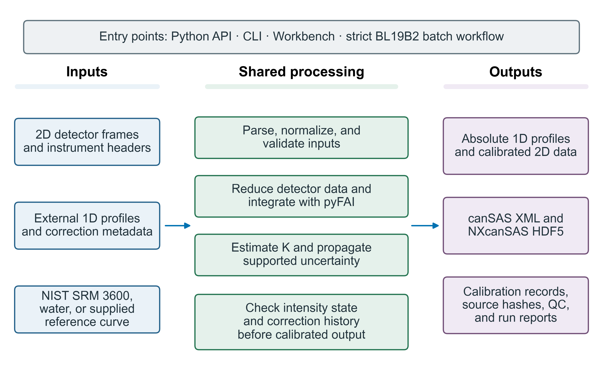

# Summary

Small-angle X-ray scattering (SAXS) profiles are easier to compare across
measurements when their intensities are reported on an absolute scale.
`saxsabs` estimates the calibration factor $K$ from a measured reference, such
as NIST Standard Reference Material (SRM) 3600 glassy carbon or water at a
documented temperature [@allen2017; @srm3600; @orthaber2000]. It normalizes
intensities using exposure, monitor, and transmission measurements, records
sample thickness and prior corrections, and exports calibrated profiles as
text, canSAS1d XML, or NXcanSAS
HDF5 [@cansas1d; @nxcansas].

The Python API and command line support reusable calculations and external
one-dimensional (1D) profiles. The bilingual Workbench provides interactive
calibration and batch operations, while a separate strict workflow processes
two-dimensional detector data under SPring-8 BL19B2 conventions. The software
stops scaling or subtraction when required physical inputs or the profile's
intensity state cannot be established.

# Statement of need

Absolute SAXS intensities, commonly reported in cm$^{-1}$, support quantitative
comparisons between samples and experiments. Their scale depends on monitor
and transmission normalization, sample thickness, and calibration against a
known reference [@allen2017; @orthaber2000]. In practice, reduced profiles
often arrive from different programs with inconsistent metadata and
processing histories. If a profile's current scale is unclear, applying a
calibration or thickness correction twice can produce a plausible curve on
the wrong intensity scale.

`saxsabs` serves beamline scientists and SAXS users who need to calibrate
external 1D profiles or process detector data while recording the inputs and
corrections behind each result. It distinguishes raw counts, relative intensity,
absolute intensity in cm$^{-1}$, and ambiguous states. Calibration and
subtraction proceed only when the declared state and required metadata agree.
The strict 2D workflow handles current BL19B2 data conventions; reusable
calculation and I/O modules also support other interfaces.

# State of the field

Existing tools cover important neighboring tasks. pyFAI performs azimuthal
integration of detector images [@pyfai], and FabIO reads two-dimensional
detector formats [@fabio]. SasView and Irena support small-angle scattering
analysis and model fitting [@sasview; @irena]. BioXTAS RAW combines BioSAXS
reduction with water- or glassy-carbon-based absolute scaling and buffer
subtraction [@bioxtasraw]. These packages remain appropriate for the tasks
they were designed to solve.

The materials-scattering work that prompted `saxsabs` required a programmatic
way to calibrate 1D profiles from different reduction programs and a strict
BL19B2 path that checks correction history before campaign scaling. A separate
package makes it possible to apply those checks without changing upstream
reduction or fitting tools: BL19B2 metadata rules stay within the campaign
workflow, while detector integration and image reading remain delegated to
pyFAI and FabIO.

# Software design

The package separates scientific calculations and file I/O from its user
interfaces (\autoref{fig:workflow}). The Python API and CLI expose reusable
normalization, calibration, parsing, subtraction, and export functions. The Workbench provides
interactive calibration and batch operations. The strict BL19B2 runner owns
campaign processing; these interfaces share calculations and I/O but do not
claim identical workflows.

Before an absolute-scale operation, `saxsabs` assesses the profile's state
from its metadata, units, column names, and correction ledger. It distinguishes
`raw_counts`, `relative`, `absolute_cm^-1`, and `ambiguous`. Conflicting or
missing evidence remains ambiguous, so the software refuses operations that
could repeat thickness or $K$ corrections. The `corrections_applied` ledger
records completed operations; a separate `do_not_repeat` field acts only as an
execution guard and cannot establish that a correction was physically
applied.

For calibration, the measured standard curve is interpolated onto the
reference grid, and pointwise reference-to-measured intensity ratios are
calculated. The estimator takes the median ratio after rejecting outliers by
the median absolute deviation. For the built-in SRM 3600 reference, a separate
curve-parallelism quality-control step uses the certificate's maximum expanded
relative-intensity uncertainty (6.25%) as the default tolerance before
outlier filtering. This is a project-defined heuristic, not a NIST per-point
acceptance limit; users can set a stricter tolerance. The synthetic example in
\autoref{fig:kfactor} illustrates the robust filtering step using a fixed-seed
profile and explicitly supplied SRM 3600 reference data; it does not represent
the built-in certificate-check path. The ratio-scatter term is an approximate
standard error of the median, assuming independent, normally distributed
inlier ratios; it does not model measurement noise or cross-$q$ covariance.
When reference uncertainty is available, it is combined in quadrature with this
term and reported as a partial $K$-factor uncertainty. In the BL19B2 workflow,
the software reports a partial combined uncertainty when shared covariance is
unquantified and does not report a system expanded uncertainty.

The strict BL19B2 workflow validates detector, monitor, transmission,
thickness or attenuation, reference, and output inputs before reduction and
calibration. It keeps required beamline metadata explicit. For attenuation,
the workflow uses a fixed 30 keV NIST SRD 126 table, while a separate diagnostic
calculator uses energy-dependent Elam data through xraydb
[@elam2002; @xraydb; @nist_srd126]. Writers support plain text and the
canSAS1d 1.1 and NXcanSAS layouts [@cansas1d; @nxcansas]. The deterministic
9×9 synthetic detector example checks reduction through export and recovers
its planted $K$ and sample curve; automated tests cover core calculations,
parsers, exporters, CLI behavior, and Workbench validation rules.

{#fig:workflow width="100%"}

{#fig:kfactor width="100%"}

# Software availability

The source code, tests, documentation, and examples are available in the [AbsSAXS
GitHub repository](https://github.com/D-sudoasd/AbsSAXS) under the BSD-3-Clause
license. The `main` branch contains the unreleased 2.0.0 candidate submitted
for review; GitHub Release v1.1.1 is an earlier version. Earlier archived
releases are indexed by the Zenodo concept record [@saxsabs_archive].

# Research impact statement

At SPring-8 BL19B2, the author has used `saxsabs` to prepare absolute-scale
SAXS/USAXS profiles for the published spinodally modulated Ti-24Nb-4Zr-8Sn
study [@gong2026acta] and for ongoing metallic-materials work. The article does
not cite `saxsabs`; the processing records are available to the editor on
request.

# AI usage disclosure

Earlier project work used GitHub Copilot, Anthropic Claude, OpenAI Codex, and
xAI Grok only for coding assistance, including code refactoring and test
scaffolding; exact versions of those earlier tools were not retained. During
this submission-preparation pass, OpenAI Codex (GPT-6) assisted with manuscript
editing, figure scripts, input validation and tests, packaging and CI updates, README and
documentation changes, and reference verification. OpenAI image generation, with a
version not exposed by the service, produced the conceptual README cover.
That cover is illustrative and contains no experimental data. Figures in
this paper are rendered by project scripts from the stated reference data and
synthetic inputs; the Workbench screenshot is a direct application capture.
Software descriptions were checked against the implementation and project
documentation; targeted tests were run; and reference metadata and DOIs were
checked against publisher, NIST, and Zenodo records. Example inputs and scripts
were checked to distinguish synthetic demonstrations from experimental
validation. The author reviewed, edited, and validated all AI-assisted code,
documentation, manuscript text, and images; made the core scientific and
software design decisions; and accepts full responsibility for the software
and manuscript.

# Author contributions

Delun Gong: Conceptualization, Data curation, Investigation, Methodology,
Project administration, Resources, Software, Validation, Visualization,
Writing - original draft, and Writing - review and editing.

# Acknowledgements

No external funding was received for this software. There was no sponsor, so
sponsor involvement is not applicable. The author declares no competing
interests.

# References
